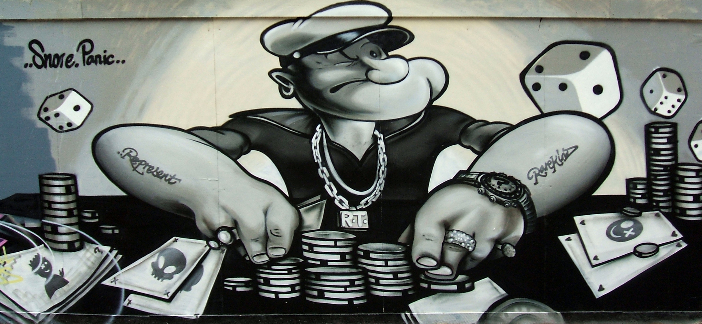

```{r echo=FALSE, message=FALSE}
library(VennDiagram)
library(ggplot2)
```

##Quick Primer on Needed Math Functions

* [Logarithm](https://www.khanacademy.org/math/algebra2/logarithms-tutorial) (a.k.a. log) $\rightarrow$ $log_{x}\left(y\right) = z$ is equivalent to $x^z = y$.
    * For example, $log_{10}\left(100\right) = 2$, since $10^2 = 100$
    * This is pronounced "*$log$ base $x$ of $y$ equals $z$*".  Or, in the example above, "*$log$ base $10$ of $100$ is $2$*".
    * If the base is left out, the base is presumed to be 10.  That is, $log\left(100\right) = 2$
    * The [*natural* log](http://mathworld.wolfram.com/NaturalLogarithm.html), written $ln\left(y\right)$, is log using the special base $e$, but we will not delve into it much.  (Click on the link for more info.)
    
* [Factorial](http://mathworld.wolfram.com/Factorial.html) (a.k.a. $!$) $\rightarrow$ $n! = n \times \left(n - 1\right) \times \left(n - 2\right) \times \cdots \times 1$
    * For example, $5! = 5 \times 4 \times 3 \times 2 \times 1 = 120$
    * $0! = 1$.  That's just defined... it works out well for formulae that rely upon it.  However, if you *must* know, here's a [decent explanation](http://mathforum.org/dr.math/faq/faq.0factorial.html).
    * Factorials are only valid on [natural numbers](http://whatis.techtarget.com/definition/natural-number) (including zero).
    
* [Binomial coefficient](http://en.wikipedia.org/wiki/Binomial_coefficient) (a.k.a. "choose") $\rightarrow$ $\binom{n}{k} = \frac{n!}{\left(n - k\right)! \times k!}$
    * For instance $$\binom{6}{4} = \frac{6!}{\left(6 - 4\right)! \times 4!} =  \frac{6!}{2! \times 4!} =$$ $$\frac{6 \times 5 \times \left(4 \times 3 \times 2 \times 1 \right)}{\left(2 \times 1 \right) \times \left(4 \times 3 \times 2 \times 1\right)} = $$ (*notice how the $4 \times 3 \times 2 \times 1$ is on both the numerator and denominator*) $$\frac{6 \times 5}{2} =15$$
    * The binomial coefficient $\binom{n}{k}$ is pronounced "*n choose k*".  So the example above would be pronounced "*6 choose 4*".
    * The binomail coefficient is only valid on natural numbers, furthermore, $k \leq n$.
    * Because $k \leq n$, binomial coefficient calculations can be simplified by $$\binom{n}{k} = \frac{n \times \left(n - 1 \right) \times \cdots \times \left(n - k + 1 \right)}{k!}$$ 
        * Applying to the example above, we could have quickly said $$\binom{6}{4} = \frac{6 \times 5}{2!} = 15$$
        * In fact, since the factorial can overflow (have too large of numbers for the computer to handle, e.g., $170! > 10^{306}$, which is the current computer limit), *n choose k* is always calculated in this way.

-----


*[Art by Dominic Alves](https://www.flickr.com/photos/dominicspics/1128401985/in/photolist-2HHmAD-qynNVq-7q8op8-7qQ76E-8Jw7Ub-7dTjSE-42zpFh-qNE9SS-oMLzWy-5HqP9c-2TRy2x-5HqSaT-9cYB7z-5Hv9UW-5HqSDF)*

#What is Probability?

*Probability* is a "mathy" word that is also used quite often in the regular world, too.  And the regular world definition of probability matches up quite well with the "mathy" definition.

Without getting too technical, probability is the **chance** that something can occur.  For instance, there is a *50% probability that a coin will land "heads" on a fair coin toss*.  Or, using the technical jargon:

$$P\left(heads \mid fair\ coin \right) = 50 \% = 0.5$$

OK, a bit of an explanation of the jargon above:

* P $\rightarrow$ probability (usually given in terms of fraction, not per cent)
* $\left(heads \mid fair\ coin \right)\ \rightarrow$ this one is a bit trickier, let's break it down further:
    * the word(s) to the left of the bar ($\mid$) are the thing that you're finding the probability of.  In this case, it's the "probability of getting a heads".
    * the bar, $\mid$, means "given that".
    * the word(s) to the right of the $\mid$ are the condition to the probability, the "given that".  In this case, "given that it is a fair coin".
    * putting this all together, $P\left(heads \mid fair\ coin \right)$ means "the probability of getting a heads given that the coin is fair".
    
-----

#Basic Tenets of Probability

##What we intuitively know

I did not need to explain above that the probability of getting a heads on a fair coin was 0.5 (or 50%).  You just "knew" that.

Similarly, it *"just makes sense"* that the probability of getting a 2 on a fair 6-sided die roll is $\frac{1}{6}$.

*(Note:  I will stop using the word "fair" when I specify the object every time.  It is important that the die roll be fair, but hereafter it will be implied / assumed.)*

-----

## Mathematical rigor

But how does it "just make sense" that the chance to get a 2 on a 6-sided die is $\frac{1}{6}$?  As we've seen in **logic** and **set theory**, some ideas that start out easy can quickly get complicated.  So, let's talk about some of the assumptions that make the die roll and the coin toss "obvious".

Specifically, here are a few attributes that $P$, the probability of an event occurring, has:

* $P$ is assigned a number between 0 and 1.
    * This simply means the chance of the outcome occurring is somewhere between "impossible" and "assured".
* $P$ is the probability of a possible outcome from an experiment / action.
    * In other words, the probability of landing a heads from a coin toss **assumes a coin is tossed**.  So, the chance that **neither a heads nor tails** occurs is zero.  Implied in the probability is that the action, in this case, the coin toss, has occurred.
* Continuing on the notion above, the probability that **something** occurs is 1, 100%.
    * "Something" can be defined as nothing, as long as the definition is in the probability.  For instance, if you want the probability that a patient has liver cancer, there are two possibilities, either the patient **has** cancer or she **does not**.
* The probability of two *mutually exclusive* outcomes is the sum of their probabilities.
    * The probability of a 1 on a die roll is $\frac{1}/{6}$, and the probability of a 2 on a die roll is = $\frac{1}/{6}$, so the probability of a **1 or 2** on a die roll is simply $\frac{1}{6}+\frac{1}{6} = \frac{2}{6} = \frac{1}{3}$.
    * Mutually exclusive?  Huh?  Can you explain that?  (Yes, I will, in the next section.)

-----

# "Adding"" Probabilities

## Mutually exclusive, explained

In the final bullet above, it said that we could simply add probabilities that were ***mutually exclusive***.  OK, now let's deal with that statement.

We went through the example:

> The probability of a 1 on a die roll is $\frac{1}{6}$, and the probability of a 2 on a die roll is $\frac{1}{6}$, so the probability of a **1 or 2** on a die roll is simply $\frac{1}{6}+\frac{1}{6} = \frac{1}{3}$

OK that makes total sense, so where's the problem?

Let's think about the following scenario:

> The probability of a 2 on a die roll is $\frac{1}{6}$, and the probability of an *even number* on a die roll is $\frac{1}{2}$ ($\frac{1}{6} + \frac{1}{6} + \frac{1}{6}$), so the probability of a **2 or an even number** on a die roll is $\frac{1}{6}+\frac{1}{2} = \frac{2}{3}$, *right*?

## "Adding" probabilities:  it's *really* the union of probabilities

Well, I'm leading you on, so the scenario above probably wrong.

Let's go through it.  What does it mean to say the following?

> the probability of an even number

This means either a 2, 4, or 6.  Ahhh... of course, I've ***counted the 2 twice***... once when I said the *probability of getting a 2*, and once when I said the *probability of getting an even number*!

OK, so in this case I get it, but how would I handle this, in a *generic* situation?  How do I handle it in a situation where maybe the probabilities are being counted twice (or more)?

We don't actually *add* the probabilities, we perform a **union** of the probabilities.  So, above, instead of saying

* The probability of two *mutually exclusive* outcomes is the sum of their probabilities.

I should have said

* The probability of two outcomes is the ***union*** of their probabilities.

How do we figure out the union?  We have to specify what the outcomes actually are, then take the union of the outcomes, which we already know to be the *combination of the outcomes, removing any duplicates*, from our *set theory* work.

> What is the probability to get either a 2 on a die roll or an even number on a die roll?

How can I get a 2 on a die roll?  Well, I have to roll a 2.  Or, the ***set of total solutions to get a 2 on a die roll*** is simply $\left\{2\right\}$.

How can I get an even number on a die roll?  I can roll either a 2, 4, or 6.  So the ***set of total solutions to get an even number on a die roll*** is $\left\{2, 4, 6\right\}$

> The union of $\left\{2\right\}$ and $\left\{2, 4, 6\right\}$ is only $\left\{2, 4, 6\right\}$ (since a *set* contains only *unique* numbers / possibilities).

Using a [Venn Diagram](http://en.wikipedia.org/wiki/Venn_diagram), we see

```{r results='hide', echo=FALSE}
draw.pairwise.venn(1, 3, 1, category = c("Blue: # ways to roll a {2}",
                                         "Pink: # ways to roll a {2, 4, or 6}"),
                   lty = rep("blank", 2), fill = c("light blue", "pink"),
                   alpha = rep(0.5, 2), cat.pos = c(0, 0), cat.dist = rep(0.025, 2))
```

we can see that there is only 1 way to roll a 2, and 2 ways to roll an even number *that is **not** a 2*, namely, to roll a 4 or 6.  So if we count up the union, it's $2 + 1 = 3$.

-----

And, of course, the total set of *possible results* on a 6-sided die is  $\left\{1, 2, 3, 4, 5, 6\right\}$

So,


$$P\left(2\ or\ even\ number \mid 6-sided\ die \right) = $$ $$\frac{\#\ of\ outcomes\ in \left\{2, 4, 6\right\}}{\#\ of\ outcomes\ in \left\{1, 2, 3, 4, 5, 6\right\}} = \frac{3}{6} = 0.5$$

## "Adding" probabilities:  it can be addition minus the intersection

Remember in *set theory* that the union can be thought of as the "addition" of two sets, minus the intersection.  Let's set up a different situation, to yield a more interesting Venn Diagram.

$$P\left(\left(< 3\right)\ or\ \left(odd\ number\right)\mid 6-sided\ die \right)$$

*(Remember, that reads "probability of getting less than a 3 or getting an odd number, given a six-sided die")*

So, looking at the following Venn Diagram of the number of outcomes

```{r results='hide', echo=FALSE}
draw.pairwise.venn(2, 3, 1, category = c("Blue: # ways to roll a {1, 2}",
                                         "Red: # ways to roll a {1, 3, or 5}"),
                   lty = rep("blank", 2), fill = c("blue", "red"),
                   alpha = rep(0.5, 2), cat.pos = c(0, 0), cat.dist = rep(0.025, 2))
```

we clearly see there are 4 total outcomes (2 outcomes only found in {1, 3, or 5}, 1 outcome found only in {1 or 2}, and 1 outcome found in both... "1").  We just add up the number of outcomes, to correctly reach 4 ($2 + 1 + 1$).

-----

But to the original point about "adding" probabilities, if we "add" that there are 3 outcomes in {1, 3, 5} and 2 outcomes in {1, 2}, then we can "subtract" the intersecting outcome of {1}.  So it's $3 + 2 - 1$.

Or, using our more formal *set theory* symbols:

$$P\left(A\ or\ B\right) = P\left(A\right) + P\left(B\right) - P\left(A\cap B\right)$$

which we know from *set theory* is mathematically identical to:

$$P\left(A\ or\ B\right) = P\left(A\cup B\right)$$

Finally, if  $P\left(A\cap B\right)$ is $0$, then we have:

$$P\left(A\ or\ B\right) = P\left(A\right) + P\left(B\right)$$

which is what was said early on.  So, when we say ***mutually exclusive***, we mean that $P\left(A\cap B\right) = 0$

-----

# "Multiplying" Probabilities

OK, when we were "adding" probabilities - or, more accurately, when we were creating the union of probabilities - we were looking at ***one event*** and the different outcomes for that one event.

## Inuitive Understanding

What about when we're looking at multiple events occurring?  For instance:

> What is the likelihood of rolling 2 sixes in a row?

You probably already know the answer, it's $\frac{1}{36}$.

You probably know how to get that answer:  simply multiply the chance for the first event occurring, $\frac{1}{36}$, by the chance for the second event occurring, also $\frac{1}{36}$.

## Mathematical Rigor

Yeah, but let's delve into why things work that way!

Earlier, when discussing the mathematically rigorous way to define a coin toss, we wrote:

$$P\left(heads \mid fair\ coin \right) = 50 \% = 0.5$$

We mentioned the "given that" portion, in this case "given that it was a fair coin", written $\left( \mid fair\ coin \right)$.  But we just left that idea hanging.  Well, let's delve into it a bit more.

We will use the same ***given that*** language in order to rigorously solve our $\frac{1}{36}$ answer above.

What's another way that we can write the following?

> What is the likelihood of rolling 2 sixes in a row?

Well, I could also say:

> What is the likelihood of rolling a six given that I've already rolled a six?

Using our rigorous symbol methods:

$$P\left(rolling\ six \mid rolled\ six \right) = \frac{1}{6} = 16.67 \%$$

-----

Wait, so the probability of rolling a 6 "given that" I've already rolled a 6 is still $\frac{1}{6}$??  Yep!

But, that's the same as the probability of rolling a 6 without any of this "given that" verbiage!  Again, yes, that's correct.  So, what's the point of using "given that"?  There are two reasons, one of which I'll give now:

> I know the probability of rolling a six, it's just $\frac{1}{6}$.  So, I can say what the probability of rolling the ***2nd*** six is.  It's simply $\frac{1}{6}$, ***given that*** I have already rolled a six.

> So, what's the probability of rolling the first six?  It's just $\frac{1}{6}$ also.

## ***Given that*** : Multiply probabilities (sort of)

So I know how to get each of the probabilities now.  I know how to get the "first" six and the "second" six.  I just need to know how to combine them.  Aha!

$$P\left(rolling\ 2\ sixes \right) = P\left(rolling\ six \right) \times P\left(rolling\ six \mid rolled\ six \right)$$

$$P\left(rolling\ 2\ sixes \right) = \frac{1}{6} \times \frac{1}{6} = \frac{1}{36}$$

Let's break this down again and make sure we understand what happened:

- We're looking for the probability that two events occurred:
    - $P\left(rolling\ 2\ sixes \right)$
- We can break that down into the probability that the first event occurred times the probability that the second event occurred ***given that*** the first event occurred:
    - $P\left(rolling\ six \right) \times P\left(rolling\ six \mid rolled\ six \right)$
- We then assess / figure out what each of those individual probabilities are.
    - In this case, it was simply $\frac{1}{6}$ for each case, and we knew that because the die was fair and there were six equally likely outcomes.

-----

OK, so I still don't understand the "given that" phrase we've been using!  It didn't make any difference in the example above.

$$P\left(rolling\ six \right) = \frac{1}{6}$$

and

$$P\left(rolling\ six \mid rolled\ six \right)$$

What's the difference?  They are both $\frac{1}{6}$, right?  Yes, ***in this case***, but not always.

## ***Given that*** : Conditional probabilities

For all the cases we've talked about above, we were looking at the probabilities of ***independent*** events occurring.

That is, if I rolled a 6 the 1^st^ time, the likelihood that I could roll a 6 the 2^nd^ time is still the same as if I had rolled anything else the 1^st^ time.

Huh?

Two roll 2 sixes, I first roll a six, then I roll another six.  Once the ***1^st^*** 6 has been rolled, it's just as likely for the 2^nd^ 6 to be rolled:  the 1^st^ one already happened.  It's in the past.  We can forget about it.

But won't that always be true?  No, not for ***dependent*** events.

-----

Here's an example.

Instead of rolling dice, let's look at playing cards.  (It's fun to stick with games & gambling!)  In case you don't know, here is some information on a deck of cards ([sans](http://en.wiktionary.org/wiki/sans) jokers):

- 52 cards total
- 4 suits, with 13 cards each:  hearts, clubs, spades, diamonds
- 13 "numbers": 2 - 10, then jack, queen, king, ace
- each card is unique
    - So, for instance, there is only one "jack of spades", or only one "3 of hearts"

Now let's calculate this one:

> What is the likelihood of being dealt two cards, and getting two queens?

Well, there are 4 queens, and there are 52 cards.  So...


$$P\left(Getting\ Queen \right) = \frac{4}{52} = \frac{1}{13}$$

and

$$P\left(Getting\ Queen \mid Got\ Queen \right) = \frac{4}{52} = \frac{1}{13}$$

so:

$$P\left(Getting\ 2\ Queens \right) = P\left(Getting\ Queen \right) \times P\left(Getting\ Queen \mid Got\ Queen \right)$$

$$P\left(Getting\ 2\ Queens \right) = \frac{1}{13} \times \frac{1}{13} = \frac{1}{169} = 0.592 \%$$

Wait, but is it?  Clearly not, otherwise, I wouldn't be asking.  So, what's wrong?

-----

Let's break down each step, and be ***super*** rigorous.  OK, first:

$$P\left(Getting\ Queen \right)$$

is ***really***

$$P\left(Getting\ Queen \mid Fresh\ Deck \right)$$

*(Note, you don't always have to specify a "given that", if it is or seems obvious enough.  I am doing it here in order to be completely clear.)*

and in that case:

$$P\left(Getting\ Queen \mid Fresh\ Deck \right) = \frac{4}{52} = \frac{1}{13}$$

But next, here is the trickier one:

$$P\left(Getting\ Queen \mid Got\ Queen \right)$$

Well, let's think about it.  There are only 4 queens (and 52 cards) in the deck.  If we've **already** pulled a queen, then we now have only ***3 queens left***, and only ***51 cards left***.  Ahhh... there is our ***CONDITIONAL*** probability in action.  So now let's correct things

$$P\left(Getting\ Queen \mid Got\ Queen \right) = \frac{3}{51} = \frac{1}{17}$$

OK, that's a pretty major change, from $\frac{1}{13}$ down to $\frac{1}{17}$.  Let's see how it impacts our final answer:

$$P\left(Getting\ 2\ Queens \right) = P\left(Getting\ Queen \mid Fresh\ Deck \right) \times P\left(Getting\ Queen \mid Got\ Queen \right)$$

$$P\left(Getting\ 2\ Queens \right) = \frac{1}{13} \times \frac{1}{17} = \frac{1}{221} = 0.452 \%$$

# Continuation...

Click here to see the next stuff...

