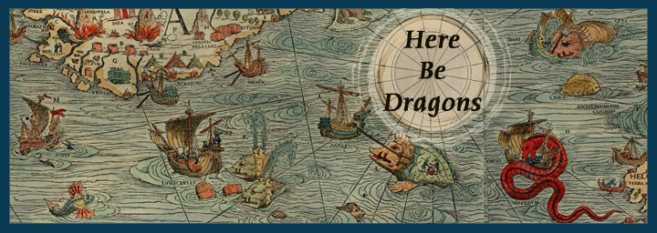

```{r echo=FALSE, message=FALSE}
library(ggplot2)
```

This document is a continuation of the Math Club - Probability, Part 1.

# Why can't Andrew Bogut hit a free throw?

## First Crack at it

Alright, I've gotten wrapped up in the Golden State Warriors lately.

But here's a fun little example to test out what we've learned.

Let's say we want to see what the likelihood is of, say, hitting 3 out of 5 free throws.  Or maybe 3 **or more** out of 5.

It seems Andrew Bogut's free throw percentage this year is [$52.4\%$](http://www.basketball-reference.com/players/b/bogutan01.html).

So, what is the likelihood that he can hit 3 out of 5?

$$P_{success} = 0.524$$
$$P_{failure} = 1 - 0.524 = 0.476$$

We will have 3 successes and 2 failures.  How many combinations allow for 3 successes and 2 failures?

$$n_{combinations} = \binom{5}{3} = \frac{5!}{3! \times (5 - 3)!} = 10$$

So the likelihood of 3 out of 5 is:

$$num\ combinations \times \left(P_{success}\right)^{num\ successes} \times \left(P_{failure}\right)^{num\ fails} =$$

$$10 \times 0.524^{3} \times 0.476^{2} = 0.326 = 32.6\%$$

So our superstar Andrew Bogut will only succeed approximately $\frac{1}{3}$ of the time.


-----

# Here There Be Dragons

> Below here, nothing has been completed yet (except for a bit of the "games" section).

In other words...

> Below *Here There Be **Dragons**...*




-----


For the moment, this is a placeholder for what I want to talk about in the future.  But the idea here is to figure out the likelihood of, say, getting 3 out of 5 free throws, if your chance of success is 80%.

## Central Limit Theorem

Talk about how, say, it's much easier to get a 7 on two dice than a 2 or a 12.  (They already get this idea.)

## Prevelence, Specificity, Selectivity.

For the moment, this is a placeholder for what I want to talk about in the future.

#Games

##Gambling on the outcomes two 6-sided dice.

* Have three teams "duke it out" to see which will win more chips.  Details:

    * each team will roll two dice
    * one team will only get numbers 6, 7, 8 (44%)
    * the next team will get 4, 5, 9, 10 (39%)
    * the other team will get 2, 3, 11, 12 (16%), but they get 2:1 odds on their chips back.
    * they will all "buy in" to whatever bucket of numbers they want.


